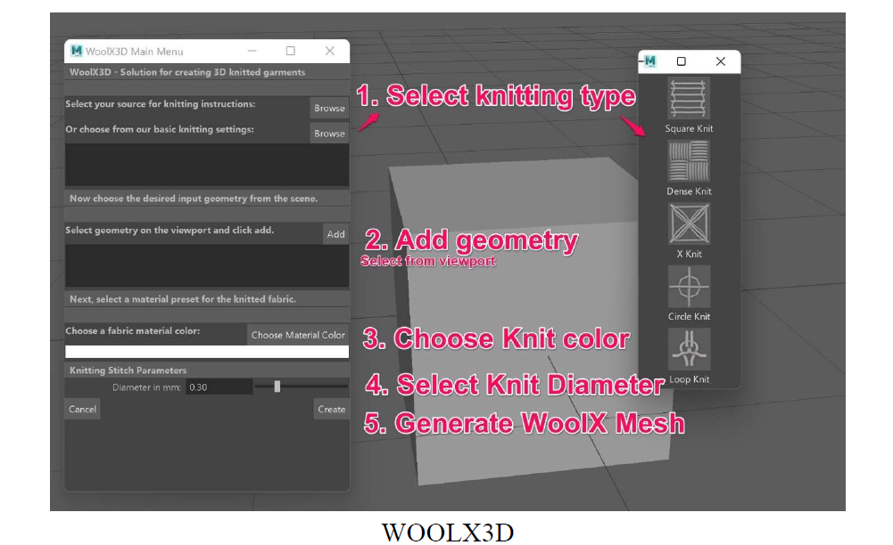
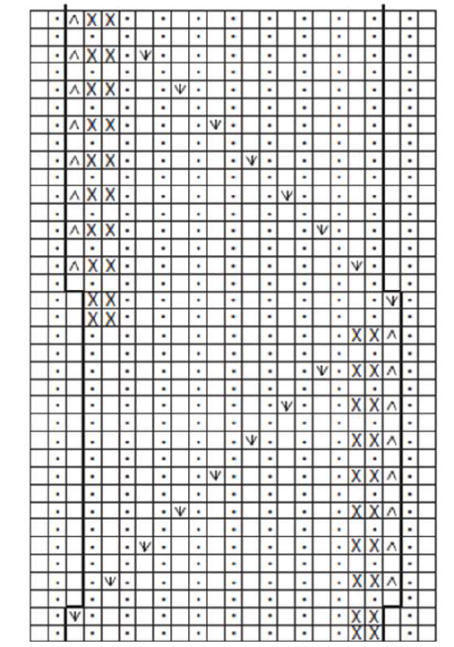
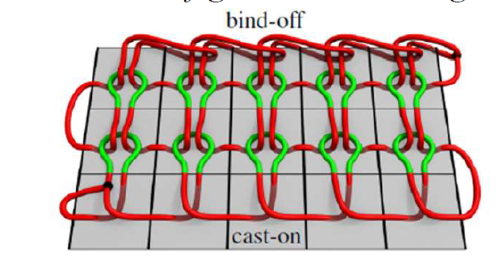
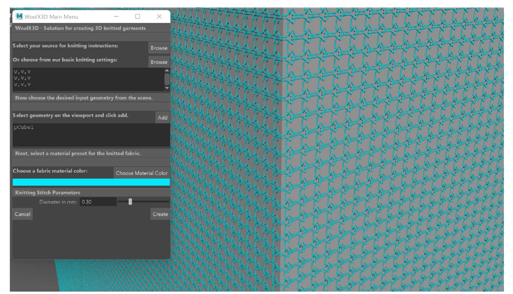

# WoolX3D
"WoolX3D: the go-to solution for creating 3D knits and stitching geometry patterns for Autodesk Maya"

## Project Overview

WoolX3D is an authoring tool that generates yarn-level stitch geometry on a base polygon mesh using a CSV-based knitting instruction matrix.
Input: base mesh + knitting instructions + stitch diameter.
Output: dense geometry with curves/cylinders representing stitch loops arranged and oriented on mesh faces.

## Goals (from design/final report)

- Save time compared to normal map or hand modeling knit detail.
- Let users specify custom knitting patterns via CSV.
- Include preset patterns and material presets.
- Align generated geometry with face normals and surface topology.
- Configure yarn diameter (fluffiness).
- Roadmap: warp knit simulation and stitch relaxation (future work).

## Core components

- C++ plugin:
  - `WoolX3D/WoolX3D/main.cpp`
  - Command: `wx3d -m "<matrix>"` or `-Matrix`
  - Registers plugin UI command and loader.
- MEL UI:
  - `WoolX3D/WoolX3D/GUI.mel`
  - Creates `WoolX3D` menu and main window.
  - Key functions:
    - `selectCSVFileDialog`
    - `selectPremadeCSV`
    - `addGeometryToList`
    - `GenerateFabric`, `CreateFabric`, `moveAlign`

## Usage

1. Build and load plugin in Maya (`WoolX3D.mll`).
2. In Maya, run `wx3d` or use `WoolX3D -> Open WoolX3D Menu`.
3. Load CSV pattern from file or preset (`knits/sample1.csv` ... `sample5.csv`).
4. Select geometry in scene.
5. Set desired radius in slider.
6. Click `Create` (runs `GenerateFabric` path).
7. Output is grouped mesh with knit instances.

## Algorithm summary (implemented vs design)

- Design-doc: row/course edge labeling, stitch types `k`, `p`, `y`, `d*, etc., and relaxation.
- Current code:
  - face-based geometry placement (loop per face)
  - `moveAlign` with face center/normal.
  - radius controls base loop size.
  - no full CSV instruction parsing yet (just CSV raw load).

## Assets / docs

- `WoolX3D Design Document.pdf` / `.txt`
- `WoolX3D Final Report.pdf` / `.txt`
- `Post Mortem Report.docx`
- `knits/sample*.csv`
- `img/` — place UI/output screenshots
- Optional: `images/` folder (create as needed)

## Images

Example markdown insertion:

## Detailed documentation

For complete specification, algorithm background, and evaluation:

- See `WoolX3D Design Document.pdf` for:
  - full user workflow and GUI mockups
  - CSV pattern format and stitch instruction matrix
  - row & course labeling methodology
  - geometry transform/relaxation formulas

- See `WoolX3D Final Report.pdf` for:
  - implementation status
  - design vs actual behavior
  - performance notes and limitations
  - future roadmap (simulation, parser, stitch mesh)

## Future improvements

- full C++ CSV parser (planned `CsvInstructionsParser`, Boost)
- row-based stitch mesh classes (`RowReadyStitchMesh`, `SimpleStitchMesh`, `RelaxedStitchMesh`)
- material picker implementation
- yarn relaxation simulation